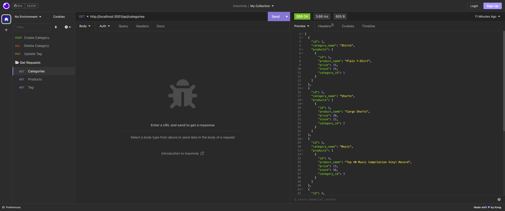

# E-commerce Back End

## Description

For this project I was tasked with backend data manipulation. I was given seed data to populate a database, and then tasked with creating code that would correspond with CRUD commands for updating the data within the database. This project helped me with the following concepts:

-Creating and manipulating databases with MySQL 
-Using the dotenv package to conceal my MySQL login info 
-Creating database models 
-Creating API routes that led to CRUD operations 
-Familiarizing myself with the Insomnia application, which helped me see my backend updates occur.

## Installation

Open the integrated terminal and login to MySQL. Create the database, seed the data, and run the server to begin.

## Usage

[Click here to view a walkthrough video of the application](https://drive.google.com/file/d/16Q3b6wH_20Q7AS05ekJbp-mOZLUiO6ZQ/view) 

## Credits

SMU Coding Bootcamp 

Starter Code - [Fantastic Umbrella](https://github.com/coding-boot-camp/fantastic-umbrella)